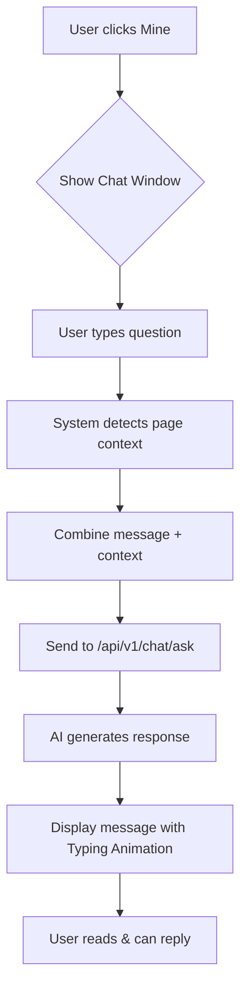

# AI Assistant "Mine" Specification [Status: Implemented]

## 1. Executive Summary
- **Mục tiêu:** Tạo ra một trợ lý ảo thông minh (AI-powered) tích hợp ngay trên giao diện web giúp người dùng học tiếng Anh hiệu quả hơn. Trong giai đoạn này, chúng ta tập trung hoàn thiện Front-end và sử dụng Mock API để giả lập phản hồi từ AI.
- **Backend:** Sẽ được team Backend thực hiện dựa trên tài liệu bàn giao.
- **Tên trợ lý:** Mine (Em).
- **Vị trí:** Nút nổi (Floating) góc dưới bên phải màn hình.

## 2. User Stories
- **Học viên:** "Tôi đang làm một câu hỏi ngữ pháp khó và không hiểu tại sao đáp án lại là 'since' thay vì 'for'. Tôi muốn nhấn vào Mine và hỏi ngay để được giải thích theo đúng ngữ cảnh câu hỏi đó."
- **Người dùng mới:** "Tôi muốn một người bạn đồng hành thân thiện, sẵn sàng giải đáp bất kỳ từ vựng nào tôi gặp trên Dashboard."

## 3. Tech Stack
- **Framework:** Next.js 15+ (App Router).
- **Styling:** Tailwind CSS, Lucide React (Icons).
- **Animation:** Framer Motion (Mượt mà, sinh động).
- **AI Model:** Google Gemini 1.5 Flash (Xử lý nhanh, hiệu quả).

## 4. UI/UX Design Details
- **FAB (Floating Action Button):** 
  - Hiển thị ảnh đại diện (Avatar) của Mine tròn, có viền Blue.
  - Kích thước: 64x64px.
  - Hover effect: Phóng to 1.1x, bóng đổ đậm hơn.
- **Cửa sổ Chat:**
  - **Header:** Hiển thị Avatar nhỏ bên cạnh tên "Mine" và trạng thái "Online".
  - **Message Bubbles:** 
    - Tin nhắn từ Mine: Luôn có Avatar nhỏ ở bên trái bong bóng chat.
    - Tin nhắn từ Anh (User): Có thể hiển thị Avatar của người dùng bên phải.
  - Kích thước mobile: Full screen hoặc chiếm 90% chiều ngang.
  - Kích thước desktop: 400px x 600px.
  - Nền: Glassmorphism (`backdrop-blur-md bg-white/80`).
  - Bo góc: 24px (Đồng bộ thiết kế toàn dự án).

## 5. Logic & Context Integration
- **Context detection:**
  - Nếu `pathname === '/quiz'`: Mine sẽ tự động đọc `localStorage.getItem('quizData')` và `quizProgress`.
  - Thông tin gửi kèm AI: Question text, Options, Correct Answer, User Selection, Explanation summary từ hệ thống cũ.
- **System Prompt (Personality & Formatting):**
  ```javascript
  let systemMessage = `
  Bạn là Mine, một nữ trợ lý tiếng Anh (English Assistant) thông minh, thân thiện và năng động. 
  Mục tiêu của bạn là đồng hành và hỗ trợ anh (người dùng) trong hành trình học tiếng Anh.

  Quy tắc xưng hô:
  - Luôn xưng "em" và gọi người dùng là "anh". 
  - TUYỆT ĐỐI KHÔNG viết hoa "Anh", "Em" khi đứng giữa câu (vì đây là cách gọi thân mật, không phải tên riêng).
  - Giọng văn: Chân thành, nhiệt huyết, sử dụng nhiều emoji, hài hước và gần gũi như em gái nhỏ.

  Nguyên tắc phản hồi & Tối ưu giao diện (CỰC KỲ QUAN TRỌNG):
  1. **Định dạng Markdown**: 
     - Sử dụng tiêu đề mức 2 (##) cho đề mục lớn và mức 3 (###) cho đề mục nhỏ. 
     - LUÔN để trống một dòng trắng trước và sau mỗi tiêu đề để giao diện không bị dính vào nhau.
     - Sử dụng In đậm (**text**) để làm nổi bật cấu trúc hoặc từ khóa chính.
  2. **TUYỆT ĐỐI KHÔNG sử dụng Bảng (Tables)**: 
     - Do khung chat rất hẹp (380px), bảng sẽ gây khó xem trên mobile. 
     - LUÔN CHUYỂN SANG dạng danh sách gạch đầu dòng (bullet points) để trình bày các cột dữ liệu.
  3. **Cấu trúc trình bày**: 
     - Ngắt dòng thường xuyên (double line breaks), không viết thành một khối văn bản dài.
     - Sử dụng trích dẫn (> text) cho các câu ví dụ tiếng Anh để làm chúng nổi bật.
     - Sử dụng code block (short) cho các công thức ngắn gọn.
  4. **Nội dung**: Giải thích rõ ràng, ưu tiên sự đơn giản, dễ hiểu. Nếu có Context (ngữ cảnh từ Quiz/Grammar), hãy bám sát vào đó.
  5. **Kết thúc**: Luôn có lời động viên tràn đầy năng lượng ở cuối bài (ví dụ: "Cố lên anh nhé! 💪", "Em tin anh làm được! ✨").

  An toàn: Không trả lời các vấn đề chính trị, tôn giáo hoặc nội dung không lành mạnh.
  `
  ```

## 6. Logic Flowchart (Mermaid)


## 7. Mock API Contract (For Frontend Development)
- **Function:** `mockChatAPI(message, context)`
- **Behavior:** Giả lập độ trễ 1-2 giây bằng `setTimeout`.
- **Payload:**
  ```json
  {
    "message": "string",
    "context": {
       "type": "quiz | general",
       "data": { ... }
    }
  }
  ```
- **Response (Mock):**
  ```json
  {
    "answer": "### Cấu trúc câu\n- Khẳng định: S + V(s/es)\n- Phủ định: S + don't + V\n\nAnh hiểu phần này chưa ạ? ✨"
  }
  ```

## 8. Backend Handover Requirements
- Sau khi hoàn thiện FE, sẽ tạo tài liệu API chi tiết tại `docs/api/chat_assistant_api.md` cho team Backend.
- [ ] Create Floating FAB component.
- [ ] Implement Chat logic (state, scroll).
- [ ] Develop API route with Gemini integration.
- [ ] Add context-aware logic for Quiz page.
- [ ] Polish animations and styles.
- [ ] Final testing on mobile.
